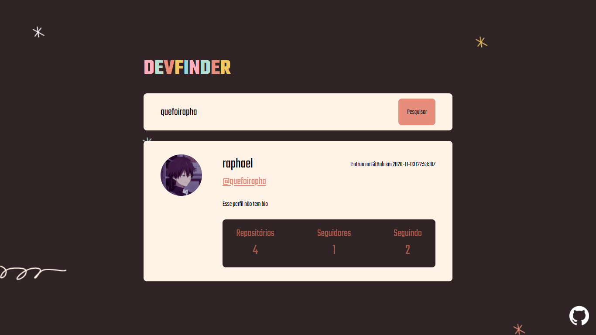

# DEVFINDER

## Introdução
Nesse projeto foi consumida a API do GitHub e feito a manipulação de dados obtidos através de inputs. O objetivo foi criar um card simples com informações de devs cadastrados no GitHub

## Techs utilizadas
* HTML: para estruturação da página;
* CSS: para estilização;
* JavaScript: para manipulação dos dados;
* [GitHub REST API](https://docs.github.com/en/rest): para pegar os dados de usuários do GitHub;
* [Ballerini Server - Brand & Style Guide](https://github.com/Ballerini-Server/BrandGuide): Documentação de estilos